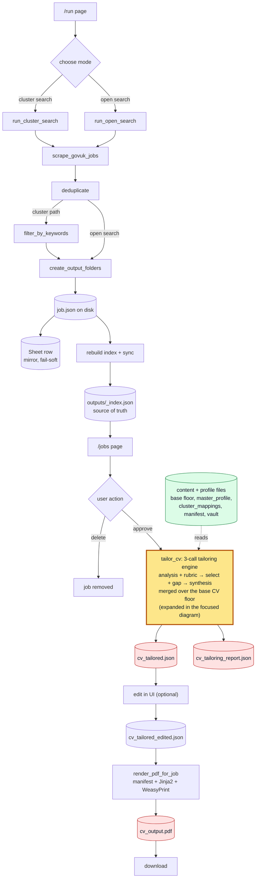
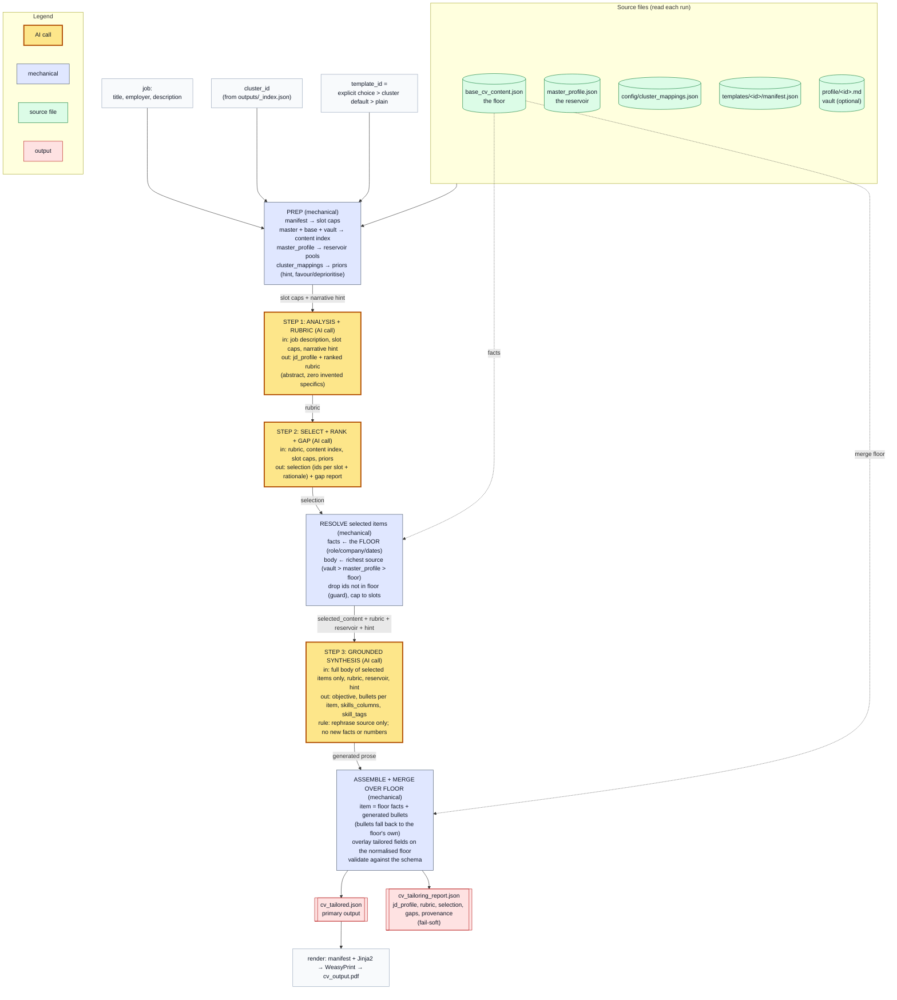

---

# Job Search Automation Pipeline

A local web app for scraping UK job listings, reviewing them in a fast browser UI, and rendering tailored CVs for the ones worth applying to.

## What it does

Scrapes UK job boards (currently findajob.dwp.gov.uk), filters results by keyword or freeform search terms, and stores them on disk and in a Google Sheet. You review jobs in a local browser, approve the ones you want to apply to, and render a tailored CV PDF for each. Tailoring runs a three-call Claude engine that selects from layered content sources and writes grounded prose over a verified base CV.

The Sheet is the canonical approval log, mobile-friendly and editable from anywhere. The local disk is the source of truth for what jobs exist and their content. UI reads happen from disk (fast); writes go to both disk and Sheet.

## Architecture at a glance

- **Scrape**: pulls jobs via `scrapers/govuk.py`
- **Disk**: each job lives in `outputs/{YYYY-MM-DD}/{slug}/job.json`, indexed in `outputs/_index.json`
- **Sheet**: each job is also appended as a row for mobile access
- **UI**: Flask + Bootstrap 5 + HTMX, reads from the disk index on every page load (never the Sheet)
- **Activity log**: `outputs/_activity.json` tracks scrape and approval events for the dashboard feed
- **CV tailoring**: a three-call engine (`pipeline/cv_engine.py`) drawing from layered content sources (vault, master profile, base floor) and biased by per-cluster mappings, producing structured JSON the user can edit, then rendered to PDF via WeasyPrint
- **Templates**: three shapes (full, lean, plain), each a Jinja2 template plus a `manifest.json` declaring its sections and slot caps

When you approve a job in the UI, the disk index updates instantly and the Sheet is updated in the background. If the Sheet write fails, the UI stays approved and a warning is logged.

The pipeline has two entry points (cluster search and open search) that converge after scraping. The disk index is the source of truth; the Google Sheet is a mobile-friendly sidecar. CV editing preserves the original tailored JSON so a user edit can always be reverted.

### Data flow: scrape to rendered PDF





### Key design decisions

- **Disk index is the source of truth.** `outputs/_index.json` is authoritative. The Google Sheet is updated write-through but reading the index never goes to the network.
- **Stable IDs over labels.** Clusters use `CLU_N` identifiers that survive renames. The UI resolves IDs to human labels at display time.
- **Pipeline functions are decoupled from the clusters service.** Scraping and filtering take cluster data as parameters; only the caller (the UI service or `main.py`) reads from `clusters.json`.
- **Original tailored JSON is never overwritten.** `cv_tailored.json` is the Claude output; user edits go to `cv_tailored_edited.json`. Reset always has something to return to.
- **Open search and cluster search converge.** They differ only at the filter step; both write through the same persistence path.
- **The base CV is the floor.** Tailoring merges over `base_cv_content.json`, so the output can only improve on a verified CV, never produce something emptier.
- **Facts are mechanical, prose is generated.** Roles, companies, and dates are assembled from the floor; the model writes only prose, which keeps the room to invent small.
- **JSON everywhere, no new dependencies.** Content, config, manifests, and the disk index are all JSON; the tailoring rework added no new runtime dependency.

### Running the app

Start the web UI:

```
ui\.venv\Scripts\Activate.ps1
python -m ui.run
```

Open `http://127.0.0.1:5000` in your browser.

### Terminal commands

Full batch pipeline: scrape, dedup, filter, then run the tailoring engine (CV and cover letter) for every scraped job, then log. This makes many API calls and triggers a live scrape, so the UI's approve-per-job flow is usually preferred:

```
python main.py --mode full
```

Scrape only, no Claude API spend:

```
python main.py --mode scrape
```

Render PDFs for approved jobs (batch renderer, uses the shared render service):

```
python render_approved.py
```

Re-tailor and re-render a single existing job from the terminal (a dev helper that fills the gap until the UI has a re-tailor button; it reads the live vault, cluster, and template choice and overwrites that job's `cv_tailored.json` and `cv_output.pdf` in place). The job is matched by a substring of its slug or output folder:

```
python retailor.py clinical_engineering                # re-tailor (live API calls) + render
python retailor.py clinical_engineering --render-only  # re-render existing JSON, no API calls
```

Rebuild the disk index from output folders (one-off utility, useful after manual file deletion):

```
python -m scripts.build_job_index
```

### Project structure

```
job-pipeline/
  main.py                  v1 CLI orchestrator
  render_approved.py       Batch PDF renderer (uses the shared render service)
  retailor.py              Re-tailor/re-render one indexed job from the CLI (dev helper)
  scrapers/                Job board scrapers (govuk active; nhs, totaljobs stubbed)
  pipeline/                Tailoring engine and supporting services
    cv_engine.py           Three-call tailoring orchestrator
    cv_sources.py          Layered source resolver and content index
    cv_schema.py           Structured CV schema (normalise, validate)
    cv_render.py           Shared Jinja2 render service
    manifest.py            Template manifest loader
    cluster_map.py         Per-cluster mapping loader
    tailor.py              tailor_cv entry point and cover letter
    dedup.py, logger.py    Dedup and Sheet logging
  config/
    clusters.json          Search clusters (gitignored; .example committed)
    cluster_mappings.json  Per-cluster tailoring priors (gitignored; .example committed)
    scrapers.json          Per-scraper settings (gitignored)
  content/
    base_cv_content.json   The floor: verified structured CV (gitignored; .example committed)
    master_profile.json    The reservoir: full history (gitignored; .example committed)
  profile/                 Markdown knowledge vault, nested by category; nodes join to CV items by frontmatter id (gitignored)
  prompts/                 Engine prompts cv_step1/2/3 (committed); v1 cv_prompt.txt (gitignored)
  templates/               One folder per template: full, lean, plain
    <id>/template.html     Jinja2 CV template
    <id>/manifest.json     Sections and slot caps
  outputs/                 Scraped jobs, index, activity log (gitignored)
    _index.json            Source of truth: all known jobs
    _activity.json         Recent scrape and approval events
    YYYY-MM-DD/<slug>/     One folder per job (cv_tailored.json, report, pdf)
  ui/                      Flask web app
    routes/                Blueprints: dashboard, jobs, pipeline, cluster_admin
    services/              Disk index, clusters, cluster_search, open_search, sheets, preview, render
    templates/             Jinja2 templates
    static/                Bootstrap, HTMX, custom JS and CSS
  scripts/                 One-off utilities
  tests/                   Pytest suite
```

## The tailoring engine

Approving a job runs `tailor_cv`, which no longer makes a single Claude call. It runs a three-call engine (`pipeline/cv_engine.py`) that separates *what the job rewards* from *what to select* from *how to write it*. The split buys control and keeps the surface where the model could invent facts as small as possible.

### Layered content sources

Every tailored field is drawn from a stack of sources, checked per item in priority order:

1. **The vault** (`profile/**/*.md`, optional): the highest-quality source when authored. Markdown nodes nested by category; each CV-facing node carries a frontmatter `id:` that joins it to a floor item (falling back to the filename stem). Several nodes may share an id and are concatenated. `tailor_cv` reads the vault on every run.
2. **`master_profile.json`**, the reservoir: your full history in your own words.
3. **`base_cv_content.json`**, the floor: a complete, verified CV.

The floor does double duty. It is the **identity registry** (each item carries a stable `id` that joins it to its `master_profile` key and vault file), and it is the **merge floor**: the engine merges its output over the floor, so any field the model does not confidently produce keeps its verified value. The engine can only improve on the floor, never produce something emptier.

### The three calls

- **Step 1, analysis and rubric.** Reads the job description, the template's slot caps, and the cluster's narrative hint. Produces a structured job profile and a ranked rubric of what the role rewards, each point paired with the kind of evidence that would satisfy it, carrying zero invented specifics.
- **Step 2, select, rank, gap report.** Reads the rubric and a lightweight content index. Assigns real item ids to the template's slots with a one-line rationale each, and reports any rubric priority the history cannot evidence. The gap report doubles as an authoring to-do list.
- **Step 3, grounded synthesis.** Reads the full body of only the selected items, plus the reservoir pools for the non-item fields. Writes the objective, the per-item bullets, and the skills. It rephrases the supplied source; it does not introduce new facts, dates, or numbers.

Between selection and synthesis the engine resolves each chosen id to its richest available body and its factual fields, dropping any id the floor cannot name (a hallucination guard).

### The cluster mapping

`config/cluster_mappings.json` is a per-cluster opinion layer keyed by `CLU_N`. For each cluster it can set a default template, a narrative hint, and favour or deprioritise lists. These bias the rubric and selection; they nudge, they do not lock, and the model can overrule them when the evidence says so.

### Diagram



### Grounding guarantees

- **Facts are assembled, not written.** Role, company, and dates travel from the floor; the model only writes prose.
- **Output is merged over the floor.** Anything not confidently produced keeps its verified value.
- **Gaps are reported, never invented.** The gap report is honest signal.
- **Provenance is recorded.** The report notes which source tier produced each selected item.

### Outputs

Each run writes `cv_tailored.json` (the structured CV, the primary output) and, fail-soft, `cv_tailoring_report.json` (the job profile, rubric, selection, gap report, and provenance) for review. `cv_tailored.json` is never overwritten by a person: user edits go to `cv_tailored_edited.json`, which wins at render time.

## Content and profile files

The files the engine reads, and how each is used. Real files are gitignored; a committed `.example` sibling documents the shape for anyone cloning the repo.

| File | Role |
|------|------|
| `content/base_cv_content.json` | The floor: a complete, verified CV in the structured schema. Identity registry and merge floor. |
| `content/master_profile.json` | The reservoir: full history in your own words, keyed by identity. |
| `config/cluster_mappings.json` | Per-cluster priors: default template, narrative hint, favour and deprioritise lists. |
| `templates/<id>/manifest.json` | The template's shape: which sections render and their slot caps. Committed. |
| `prompts/cv_step1_analysis.txt`, `cv_step2_select.txt`, `cv_step3_synthesis.txt` | The three engine prompts. Committed. |
| `profile/<id>.md` | Optional vault entries: the highest-quality per-item source when authored. |

## What works today

- Runtime-editable search clusters with a CRUD UI (create, edit, toggle active, delete)
- Cluster scrape triggered from the browser
- Open search scrape with freeform terms
- Fast browser UI for reviewing jobs
- Approve action with instant UI update and Sheet write-through
- Render PDF for approved jobs (per-job, from the UI; or batch from the CLI)
- Live activity feed on the Dashboard
- CV editing in the browser with live preview
- Multi-step grounded tailoring: a three-call engine that selects from layered sources and writes over a verified base CV, with per-cluster defaults and framing
- Three template shapes (full, lean, plain); full and lean are styled, plain is a deliberate copy-paste stub

## Coming next

- Split tailoring from approval, so re-tailoring and re-rendering do not require re-approval
- Re-render button: edit the tailored JSON and re-render over the existing PDF
- Manual entry: add a job by hand for tailor-only use, without a scrape
- Per-stage model selection: assign a different Claude model to each tailoring step, with a UI to switch
- Cross-run dedup to prevent previously deleted jobs from returning in fresh scrapes
- Background workers for long scrapes, with progress indicators
- Archive button wiring and bulk actions on the Jobs page
- Rename the Run page to Scraper

## Testing

```
python -m pytest tests/ -v

```

The suite (over 150 tests) covers the tailoring engine (run offline via an injected Claude caller), the data layer and schema, template manifests and rendering, the cluster services, and the disk index and activity log.

## License

Personal project, all rights reserved.