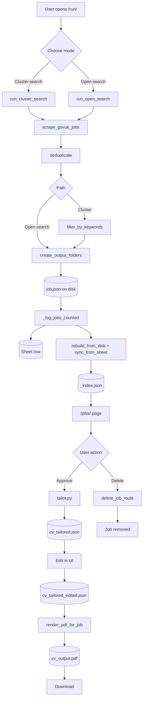

---

# Job Search Automation Pipeline

A local web app for scraping UK job listings, reviewing them in a fast browser UI, and rendering tailored CVs for the ones worth applying to.

## What it does

Scrapes UK job boards (currently findajob.dwp.gov.uk), filters results by keyword or freeform search terms, and stores them on disk and in a Google Sheet. You review jobs in a local browser, approve the ones you want to apply to, and render tailored CV PDFs for each one using the Claude API.

The Sheet is the canonical approval log, mobile-friendly and editable from anywhere. The local disk is the source of truth for what jobs exist and their content. UI reads happen from disk (fast); writes go to both disk and Sheet.

## Architecture at a glance

- **Scrape**: pulls jobs via `scrapers/govuk.py`
- **Disk**: each job lives in `outputs/{YYYY-MM-DD}/{slug}/job.json`, indexed in `outputs/_index.json`
- **Sheet**: each job is also appended as a row for mobile access
- **UI**: Flask + Bootstrap 5 + HTMX, reads from the disk index on every page load (never the Sheet)
- **Activity log**: `outputs/_activity.json` tracks scrape and approval events for the dashboard feed
- **CV tailoring**: per-job Claude API calls produce JSON the user can edit, then render to PDF via WeasyPrint

When you approve a job in the UI, the disk index updates instantly and the Sheet is updated in the background. If the Sheet write fails, the UI stays approved and a warning is logged.

The pipeline has two entry points (cluster search and open search) that converge after scraping. The disk index is the source of truth; the Google Sheet is a mobile-friendly sidecar. CV editing preserves the original tailored JSON so a user edit can always be reverted.

### **Data flow:** 

**from scrape to rendered PDF** 





### Key design decisions

- **Disk index is the source of truth.** `outputs/_index.json` is authoritative. The Google Sheet is updated write-through but reading the index never goes to the network.
- **Stable IDs over labels.** Clusters use `CLU_N` identifiers that survive renames. The UI resolves IDs to human labels at display time.
- **Pipeline functions are decoupled from the clusters service.** Scraping and filtering take cluster data as parameters; only the caller (the UI service or `main.py`) reads from `clusters.json`.
- **Original tailored JSON is never overwritten.** `cv_tailored.json` is the Claude output; user edits go to `cv_tailored_edited.json`. Reset always has something to return to.
- **Open search and cluster search converge.** They differ only at the filter step; both write through the same persistence path.

### Running the app

Start the web UI:

```
ui\.venv\Scripts\Activate.ps1
python -m ui.run
```

Open `http://127.0.0.1:5000` in your browser.

### Terminal commands

Full v1 pipeline (scrape, dedup, filter, tailor, log):

```
python main.py --mode full
```

Scrape only, no Claude API spend:

```
python main.py --mode scrape
```

Render PDFs for approved jobs (v1 batch renderer):

```
python render_approved.py
```

Rebuild the disk index from output folders (one-off utility, useful after manual file deletion):

```
python -m scripts.build_job_index
```

### Project structure

```
job-pipeline/
  main.py                  v1 CLI orchestrator
  render_approved.py       v1 batch PDF renderer
  scrapers/                Job board scrapers (govuk active; nhs, totaljobs stubbed)
  pipeline/                Dedup, keyword filter, tailoring, sheet logging
  config/
    clusters.json          Runtime-editable search clusters (gitignored)
    clusters.example.json  Committed example shape
    scrapers.json          Per-scraper settings (gitignored)
  content/                 CV content reservoir (gitignored)
  profile/                 Knowledge graph for tailoring (gitignored)
  prompts/                 Claude prompts (gitignored)
  templates/               CV HTML templates for WeasyPrint (A, B, C)
  outputs/                 Scraped jobs, index, activity log (gitignored)
    _index.json            Source of truth: all known jobs
    _activity.json         Recent scrape and approval events
    YYYY-MM-DD/<slug>/     One folder per scraped job
  ui/                      Flask web app
    routes/                Blueprints: dashboard, jobs, pipeline, cluster_admin
    services/              Disk index, clusters, cluster_search, open_search, sheets, preview
    templates/             Jinja2 templates
    static/                Bootstrap, HTMX, custom JS and CSS
  scripts/                 One-off utilities
  tests/                   Pytest suite
```

## What works today

- Runtime-editable search clusters with a CRUD UI (create, edit, toggle active, delete)
- Cluster scrape triggered from the browser
- Open search scrape with freeform terms
- Fast browser UI for reviewing jobs
- Approve action with instant UI update and Sheet write-through
- Render PDF for approved jobs (per-job, from the UI; or batch from the CLI)
- Live activity feed on the Dashboard
- CV editing in the browser with live preview
- Template A is the designed CV layout; Template C is a placeholder for a plain-text variant

## Coming next

- Rename the Run page to Scraper
- Split tailoring from approval (Tailor button generates the CV, Approve locks in the edited JSON for rendering)
- Multi-step Claude tailoring pipeline using the profile knowledge graph
- Cross-run dedup to prevent previously deleted jobs from returning in fresh scrapes
- Background workers for long scrapes, with progress indicators
- Archive button wiring and bulk actions on the Jobs page

## Testing

```
python -m pytest tests/ -v

```

Tests cover the disk-based job index and the activity log services.

## License

Personal project, all rights reserved.